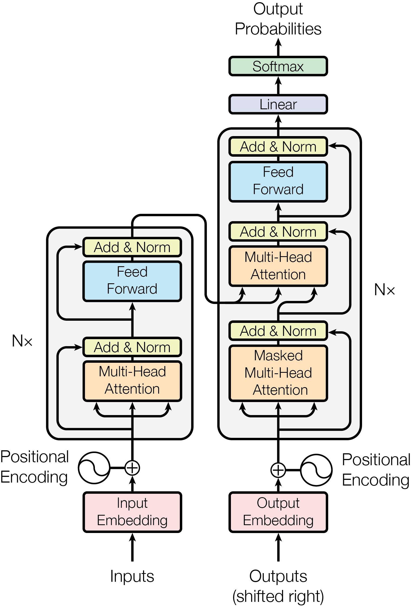
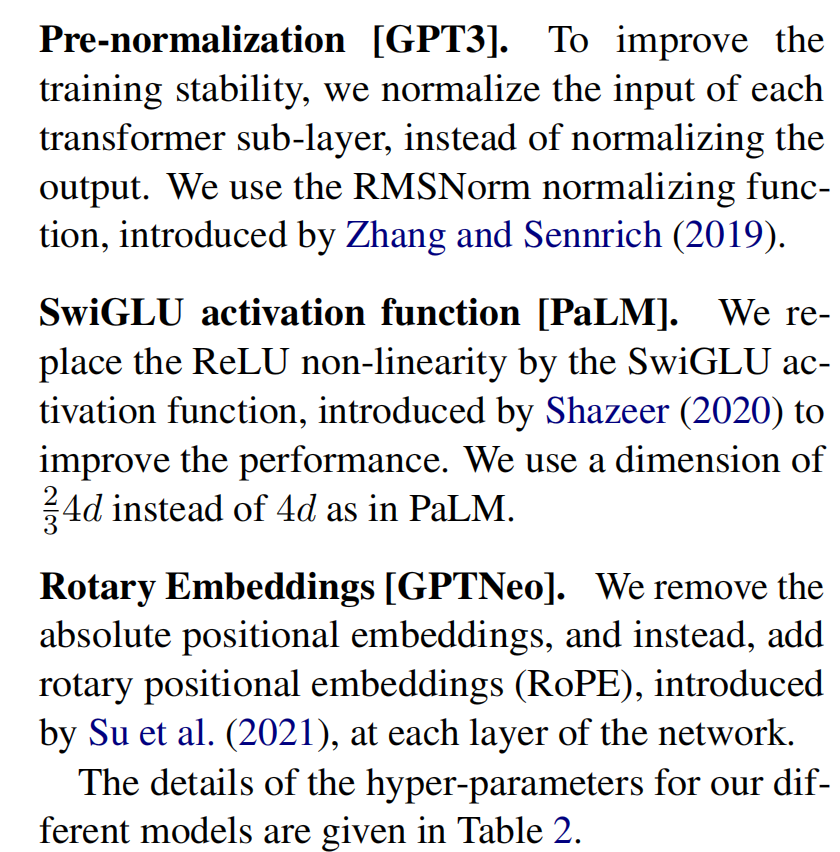

# ai架构演进总结和基于项目的的 model 推荐

## transfomer 架构介绍

先来简单介绍一下 transformer 架构，transformer 架构延续了之前主流的 encoder 和 decoder 的架构，主要优化点是将attension从 rnn 的附属部件上移到核心架构层。

下面是从论文中提取的架构图



左侧是 encoding 右侧是 decoding 层，

### encoding

```text
            [Output]
               ^
               |
         +------------+
      +->| Add & Norm |
      |  +------------+
      |        ^
      |    +-------+
      |    |  FFN  |
      |    +-------+
      |        ^
      +--------+--------+ (Residual)
               |
         +------------+
      +->| Add & Norm |
      |  +------------+
      |        ^
      |    +-------+
      |    |Self-Attn|
      |    +-------+
      |        ^
      +--------+--------+ (Residual)
               |
            [Input]
```

* self_attension:将孤立的词向量变成融合整个句子信息的向量，通过 mult_head机制实现多个维度的处理。
* ffn：通过非线性变化对之前的信息进行更深入的提取
* residual： 残差归一化，将处理完的信息和处理前的信息同时交给上游（sublayer(x)+x）保证当前层不会丢失结果
* layer noramalization：归一化处理

为了让（sublayer(x)+x）成立，整个 encoder 层中的矩阵统一。

### decoding

```text
[Output]
               ^
               |
         +------------+
      +->| Add & Norm |
      |  +------------+
      |        ^
      |    +---------+
      |    |   FFN   |
      |    +---------+
      |        ^
      +--------+--------+ (Residual)
               |
         +------------+
      +->| Add & Norm |
      |  +------------+
      |        ^
      |    +---------+
      |    |Cross-Att|<---- [Encoder Output]
      |    +---------+
      |        ^
      +--------+--------+ (Residual)
               |
         +------------+
      +->| Add & Norm |
      |  +------------+
      |        ^
      |    +---------+
      |    | Masked  |
      |    |Self-Attn|
      |    +---------+
      |        ^
      +--------+--------+ (Residual)
               |
            [Input]
```
* self_attenation:引入掩码机制，训练时同时处理所有词汇，运行时将未来词的注意力权重变为负无穷，实现类似顺序的语言生成结果。
* cross-att，encoder 和 decoder 的交汇层，decoder 发送 q 在encoder 的信息中匹配对应的 value 和 key
* 其他构建大致相同

## decoder-only 现代模型的大部分实现形式

在实际的工程模型中，并没有采用transfomer原始的架构模型，在 attension is all you need 的那篇论文可以看到，transfomer 的架构设计于翻译任务，encoder 负责理解现有的语义，decoder 负责进行转化（大致上，并不是很准确），而在实际工程例子中最常见的方法是只保留 encoder 和 decoder一个架构进行训练，一方面，保留一个架构让参数和计算单元完全聚焦于一个架构上，另一方面这种选择不必维护两套体系，而只聚焦一套体系。

从功能上，选择encoder使用双向选择机制，以类似选词填空的形式进行训练，参数极小，针对搜索等功能能力较强。而 decoder 的选择则是让模型聚焦到后续的语句的补全，而GPT-3 的出现向业界证明了一个奇迹：不需要结构化的 Encoder 来理解特定任务，只要给 Decoder 看几个例子，它就能顺着逻辑续写下去。而这也就是为什么目前绝大多数模型都是在向 decoder 方向演进，基于 decoder 的大模型则是我们一般意义上说的大模型。

### 传统 decoder-only 的实现
该架构的典型代表是 gpt2
```text
      [ h_out ]
          ^
         (+)<----------------------+
          ^                        |
   +--------------+                |
   |  FFN (GELU)  |                |  residual
   |  W1 -> W2    |                |
   +--------------+                |
          ^                        |
   +--------------+                |
   |  LayerNorm   |                |
   +--------------+                |
          ^                        |
          +------------------------+
          |
         (+)<----------------------+
          ^                        |
   +--------------+                |
   | Masked MHA   |                |  residual
   | n_kv = n_q   |                |
   +--------------+                |
          ^                        |
   +--------------+                |
   |  LayerNorm   |                |
   +--------------+                |
          ^                        |
          +------------------------+
          |
      [ h_in ]

输入端：h_0 = Embedding(id) + AbsolutePosEmbedding(pos)
```
gpt2 本身对于 transfomer docoder 部分没有显著性的改变，最主要的工作在于将 decoder 从原本的框架中抽象出来
- 去掉 cross-attension层，这个是移除 encoder 部分之后很自然的操作。
- postln -> preln 先训练再归一化转变成先归一化再训练，这部分的改变更多聚焦到训练稳定性的方面
- 放弃了放弃了原版复杂的正弦/余弦（Sinusoidal）绝对位置编码，改用和词向量完全一样的可学习绝对位置嵌入矩阵lape，简单来说，就是给词语具体的矩阵点位。


### 更新的 decoder-only的实现
该架构基于 llama 的论文

```text
      [ h_out ]
          ^
         (+)<----------------------+
          ^                        |
   +--------------+                |
   | FFN (SwiGLU) |                |  residual
   | gate up down |                |
   +--------------+                |
          ^                        |
   +--------------+                |
   |   RMSNorm    |                |
   +--------------+                |
          ^                        |
          +------------------------+
          |
         (+)<----------------------+
          ^                        |
   +--------------+                |
   | Masked GQA   |<--- RoPE       |  residual
   | n_kv < n_q   |     (旋转 Q/K) |
   +--------------+                |
          ^                        |
   +--------------+                |
   |   RMSNorm    |                |
   +--------------+                |
          ^                        |
          +------------------------+
          |
      [ h_in ]

输入端：h_0 = Embedding(id)      <-- 不再加绝对位置
```

下面是论文截图，论文是 llama1 的架构特点，


- pre-normalization：和 gpt2 一致也是将归一化移到了 input 的部分，不同是将归一化的数学算法进行优化（移去了原本没有意义的部分）
- swiglu activation: 针对 ffn 部分的算法优化，前面提到 ffn 的非线性化，这种非线性化通过将小于 0 的数据直接去掉实现，而在这里的非线化将负数部分拟合成特定曲线，保留了负数的部分信息，这部分的 2/3 4d 的参数实际是为了公平性，swiglu的算法使用了三个矩阵进行抽象信息的展开和压缩，而在原来的算法中只使用了两个
- rotatry embedding：这一部分将输入部分的词向量坐标在复数位面上表述，根据位置 m 旋转特定角度 m*etheter，这样相对位置可以直接通过点积算出来（在 transfomer 架构中采用三角函数，这个也是数学上的优化，之前通过加法放到向量上，这个相当于乘以 e 的指数进行携带位置信息，并在每一次进行 qv 请求之前重新进行选址。）
- mqa 的 kv 机制，这个路线类似语言中对协程的调用方式，单头单kv->所有头总 kv->部分头对应一个 kv 示例（类似 go 的 qmp 机制）

## 最近的 docoder-only优化机制
以 deepseek v3 为例子
```text
                         [ h_out ]
                             ^
                             |
                       +-----------+
                       | LM Head   |
                       +-----------+
                             ^
                             |
                      +-------------+
                      |  RMSNorm    |
                      +-------------+
                             ^
                             |
                 +-----------+-----------+
                 |                       |
                 |       residual        |
                 |                       |
             +---+-----------------------+
             |     DeepSeekMoE           |
             |                            |
             |  +---------------------+   |
             |  | Shared Expert × 1  |   |
             |  +---------------------+   |
             |            +               |
             |            |               |
             |      +-----v-----+         |
             |      |  Router   |         |
             |      +-----+-----+         |
             |            | Top-8         |
             |     +------+------+       |
             |     |      |      |       |
             |   Expert Expert ... Expert |
             |     +------+------+       |
             +----------------------------+
                             ^
                             |
                      +-------------+
                      |  RMSNorm    |
                      +-------------+
                             ^
                             |
                 +-----------+-----------+
                 |                       |
                 |       residual        |
                 |                       |
             +---+-----------------------+
             |        MLA Attention      |
             |                           |
             |   Query latent compression|
             |          ↓                |
             |        qC + qR             |
             |                           |
             |   KV latent compression   |
             |          ↓                |
             |        cKV + kR            |
             |                           |
             |       RoPE on qR/kR       |
             +---------------------------+
                             ^
                             |
                           [ h ]
                             ^
                             |
                         Embedding
```
- mla: 不同于 gqa 的方向，将 kv 压缩到低维空间，并额外缓存位置信息（压缩破坏位置信息）
- moe：并非使用单独 ffn 层而是使用多个专家，每个 token 只激活部分专家而非全部。（存在通用能力的专家，以及专家选择上的优化。）

## 演进总结
* 总的来说，整体逻辑没有转折性改动，核心优化和改动点集中一下这几个方面
- Norm 的位置与类型	Post-LN → Pre-LN → RMSNorm（→ 加 QK-Norm）
- 位置信息注入点	输入端加绝对位置 → 注意力内部旋转 Q/K（RoPE）
- FFN 的形式	ReLU/GELU 两矩阵 → SwiGLU 三矩阵 → MoE 稀疏专家
- K/V 的份数	MHA → MQA → GQA → MLA（压缩成 latent）

## 模型选择基准

我理解的 model 选择基准是，一个架构典型机制简单，聚合已经得到验证的改动同时没有非主流或者正在被验证的结构，没有过多动态结构算子库相对简单，具备大量开源资料和生态的模型。poc 阶段的模型要满足的一点就是便于跑通整个流程和覆盖我们期望优化提升效率的方向。我们之前讨论了整条演进路线，其中 llama2 的大部分结构是作为目前通识性的普遍结构,而 deepseekv3 的 moe 机制相对较新并且存在动态性在硬件上很难处理

如果从当前主流 Dense LLM 的演进来看，第一代 Transformer 推理系统已经逐渐形成了一套比较稳定的基础结构：

```text
Dense Decoder-only Transformer
        +
Pre-Norm
        +
RMSNorm
        +
RoPE
        +
SwiGLU
        +
GQA
        +
KV Cache
```

这种共识性的优化应该成为整个 ASIC + Compiler + Runtime 的目标工作链路
因此，本项目第一阶段真正希望覆盖的是：

```text
Dense Decoder-only
├── Pre-Norm / RMSNorm
├── RoPE
├── SwiGLU
├── Dense Linear / MatMul
├── GQA Attention
└── KV Cache
```

在此基础上，再把 LLM serving 中已经得到充分验证的运行时机制作为工作负载加入：

```text
Prefill / Decode 两阶段
        +
Continuous / In-flight Batching
        +
Paged KV Cache
        +
Memory-aware Fusion
```

这里需要区分两类东西：

**模型结构**决定 ASIC 的算子与数据通路应该支持什么；模型结构指的是 onnx 图中展现出来的计算流程和计算单元。

**Serving workload**决定这些硬件应该在什么访问模式下工作。onnx 图中只是静态的，prefill 和 decode 阶段（阅读用户的输入以及给出输出）都会经历这种计算图，但是具体的数据访问和数据类型并不一样。

onnx 图：静态地描述一个神经网络从输入到输出的完整计算过程。把模型表示成一张计算图，明确每个算子做什么、输入输出是什么、数据怎么流动。

而除了核心的架构和算法的修改外，在上层调度上也有一些典范性的策略（推理引擎 l1 层）：例如 Continuous Batching、PagedAttention ，建立在 KV Cache 和自回归 Decode 之上的通用推理机制。PagedAttention 的核心问题是 KV Cache 动态增长带来的碎片与容量浪费（很大程度上由 continue batching 产生），通过类似虚拟内存的手段去减少浪费，并让新请求可以复用。而 continue batchiing 则从 iteration-level scheduling 出发处理生成式模型的动态 batching，针对多个请求的综合 batch，每次进行迭代处理。

因此，我们的 ASIC 不应该针对某一个模型的固定 shape 做特化，而应该针对：

> **Dense-GQA Transformer 在 Prefill/Decode、Batching 和 KV Cache 场景下表现出的稳定计算与访存模式进行硬件与编译器协同优化。**

我们选择模型实际上是翻反过来选择能支持我们需求的模型。

---

## 项目的核心优势应该体现在哪里


真正值得展示的是：
> **通过 Compiler + Dataflow Accelerator + Runtime 的联合设计，把 Dense-GQA Transformer 中最稳定、最重复的计算和访存模式映射成高复用的数据流，从而降低片外访存、提高 MAC 利用率，并改善 Decode 阶段的硬件利用率。**

具体可以落到下面几个方向。

### 1. GQA-aware KV Cache：围绕 KV Head Sharing 做硬件级优化

kv cache 在 docoder 阶段是一个主要的内存瓶颈点，在上面模型架构演进角度我们讨论了如何通过分组安排去减少大量的 kv cache 在减少 KV Cache 从 HBM 到 SRAM 的搬运量，以及 SRAM 内部向计算单元的传输，下面我们来讨论一下在这个项目中我们可以怎么针对这个问题进行进一步优化。

在 gqa 中多个 Query Head 共享同一组 KV。
在通用 gpu 中为了满足计算规则来适配上层构建不得不采用 repeat_kv 来进行复制，这种方式并没有发挥出来gqa 的优势

```text
KV
 ↓
repeat_kv
 ↓
复制成完整 Q head 数量
 ↓
Attention
```

在我们自己搭建的 asic 上，完全可以实现一个从上到下的针对性优化，例如在 sram 进行广播等，将 repeat_kv优化掉，这里需要从编译器开始就进行支持。

```text
Q Head
   ↓
KV Group Mapping
   ↓
直接定位共享 KV Cache
```

即把：

```text
query_head_id
        ↓
kv_group_id
        ↓
physical KV page / SRAM bank
```

直接交给硬件地址生成与 Runtime 管理。
因此，这可以成为我们 ASIC 一个非常明确的优化点：

> **GQA-aware KV Cache Address Generation + Group-aware Data Movement**

它不仅验证 Attention 本身，还能验证：

```text
Compiler
   ↓
GQA grouping metadata
   ↓
Runtime
   ↓
KV Cache manager
   ↓
DMA / SRAM / Attention engine
```

整个链路的协同。

---

### 2. Prefill / Decode 双模式数据流

我们之前提到了 llm 推理中可以分成两个阶段，两个阶段共享一个计算流程共享一个计算图（也就是 onnx 图流程一样），但是不同的阶段输入的张量不同，导致两种计算途径的瓶颈点和优化点不同，而在我们进行这个项目构建的时候，需要从上到下根据输入张量的判断来进行分流化的优化方式。

```text
Prefill:
一次处理大量 token
→ 大矩阵
→ 高计算密度
→ GEMM 更容易充分利用 MAC

Decode:
一次通常只生成一个 token
→ M 很小
→ GEMV / small-M GEMM
→ 计算单元容易空闲
→ Memory-bound 特征明显
```

这一差异已经被大量 LLM serving 研究验证。Splitwise 对这一点进行了系统性的 workload characterization：Prefill 更偏计算密集，而 Decode 更偏内存密集，二者具有明显不同的资源需求。（splitwise 将两个模式直接对应不同的硬件设计，例如 prefill 提供更高算力的硬件，decode 提供更高的带宽）

因此 ASIC 可以围绕两个阶段分别设计数据流：

```text
Prefill
→ Weight reuse
→ Tile-based GEMM
→ 高 MAC utilization

Decode
→ Token batching
→ KV streaming
→ Weight reuse
→ Memory bandwidth optimization
```


---

### 3. Continuous Batching / Token-level Batching

Decode 最大的问题之一，是单个 Request 每次只产生一个 Token，导致：

```text
M = batch_size
```

通常远小于传统矩阵乘法的理想 M。

因此，Runtime 不应该把 Request 看成固定不变的 Batch，而应该允许：

```text
Request A
Request B
Request C
Request D
        ↓
当前 active tokens
        ↓
Dynamic Token Batch
        ↓
统一进入 Accelerator
```

Orca 提出的 iteration-level scheduling 就是围绕生成式模型的这种多 iteration 特性进行设计，并进一步通过 selective batching 提高 batching 灵活性。来实现对硬件单元更充分的利用，如果我们想要实现这种优化，需要针对硬件接口进行扩展。

```text
[token_0, token_1, ..., token_B]
+
[position_id]
+
[sequence_id]
+
[kv_page_table]
+
[kv_group]
```

而不是只接受一个静态的 `[batch, seq_len, hidden]` Tensor。

这会让：

> **Runtime 调度 → Compiler → Accelerator**

真正形成一个闭环。


### 4. FlashAttention-style IO-aware Attention

Attention 并不一定需要把中间的：

```text
QK^T
 ↓
Softmax
 ↓
P
 ↓
PV
```

全部写回片外存储。在传统的 attension 中将数据写会 hbm 是因为qkv 产生的 source 和p 过于巨大在 sram 中难以塞下

FlashAttention 的核心就是利用 tiling 和片上 SRAM 减少 HBM 与片上存储之间的数据搬运，将巨大的 kqv 拆解成小的，在 sram 中完成所有计算完成之后立刻作用于 softmax

这里产生的一个问题是这种片段性的书写会导致 softmax 运算时会不能确定全局的最大值，针对这种问题的优化只需要乘以特定的缩放因子，同时更新当前最大值

对于 ASIC 来说，这个优化非常适合直接转化成硬件数据流：

```text
Q tile
   ↓
K tile
   ↓
QK^T
   ↓
Online Softmax
   ↓
V tile
   ↓
Attention Output
```

中间结果尽量保留在：

```text
SRAM / Register
```

而不是：

```text
SRAM
 ↓
HBM / DRAM
 ↓
SRAM
```

所以这个核心优化点在于Compiler 能否识别 Attention 计算区域，并将 QK^T + Softmax + PV 映射成片上流式数据通路。因此这个优化方向同样需要多个层间的协同工作。

---


# 模型选择

针对项目的不同阶段，应该有不同的模型的选择

```text
Tier 1：Clean Baseline
→ TinyLlama 1.1B

Tier 2：Main Qualification Model
→ Qwen2.5-0.5B

Tier 3：Modern / Scale Validation
→ Llama 3.2 1B
→ Mistral 7B
```


## 1. Qwen2.5-0.5B 


其官方模型资料给出的结构为：

```text
Parameters        0.49B
Layers            24
Hidden Size       896
Attention Heads   14 Q / 2 KV
Intermediate      4864
Context           32,768
Architecture      RoPE + SwiGLU + RMSNorm
GQA               Yes
Attention QKV Bias Yes
Tied Embedding    Yes
```

Qwen 官方模型卡明确给出了上述结构，并说明 Qwen2.5-0.5B 使用 GQA、QKV bias 和 tied embeddings。 Hugging Face 当前 Transformers 实现中，Qwen2 的 `q_proj/k_proj/v_proj` 也明确使用 bias=True，而 MLP projection 使用无 bias 的 Linear。

0.5b 是非常大的优势，但是另一个优势是它非常适合作为 Compiler 的第一道真正测试，避免 complier 固定在一些特化数据中，

```text
hidden_size = 896
Q heads = 14
KV heads = 2
FFN = 4864
```

这些 shape 并不是为了适配某一个常见的 1024/2048/4096 固定模板而设计的，因此可以迫使 Compiler 真正处理：，动态 Tile Size，非标准矩阵 Shape，GQA Group Mapping，Memory Layout，Padding / Tail Handling

同时它又没有一些moe 这种动态化过于复杂的额外结构。

因此它非常适合承担：**主 POC + Compiler Qualification + GQA/KV Cache 验证** 的角色，适合作为真正阶段性完成的模型验证


### ONNX

[Qwen2.5-0.5B ONNX Repository](https://huggingface.co/onnx-community/Qwen2.5-0.5B-ONNX?utm_source=chatgpt.com)

该仓库当前提供 `model.onnx`、FP16、INT8、Q4 等多个 ONNX 版本，其中包含一个约 997 MB 的 FP16 ONNX 文件。

---

## 2. TinyLlama-1.1B —— Clean Reference Baseline

TinyLlama 更适合作为：

> **最干净的 Dense-GQA Transformer reference model**

其结构：

```text
Parameters        ≈1.1B
Layers            22
Hidden Size       2048
Attention Heads   32 Q / 4 KV
Intermediate      5632
Context           2048
RMSNorm           Yes
RoPE              Yes
SwiGLU            Yes
GQA               Yes
KV Cache          Yes
QKV Bias          No
Tied Embedding    No
```

这些结构可以直接从其当前配置确认。

相比 Qwen2.5，它少了一些额外特性：

```text
无 QKV bias
无 tied embedding
Context 仅 2048
```

所以它特别适合验证最基础的model 数据流途径的通畅性。
因此 TinyLlama 不一定是最终 benchmark，但非常适合作为，我们最开始的一个demo 级别的一个基线模型，比较适合一个初始阶段的基础功能完成的验证

### ONNX

[TinyLlama 1.1B ONNX Repository](https://huggingface.co/onnx-community/TinyLlama-1.1B-Chat-v1.0-ONNX?utm_source=chatgpt.com)

当前仓库提供完整 ONNX 模型目录和 tokenizer/config 等配套文件。

---

## 3. Llama 3.2 1B —— Modern Llama Qualification
它的主要结构为：

```text
Parameters        ≈1B
Layers            16
Hidden Size       2048
Attention Heads   32 Q / 8 KV
Intermediate      8192
Context           131,072
RMSNorm           Yes
RoPE              Yes
SwiGLU            Yes
GQA               Yes
Tied Embedding    Yes
KV Cache          Yes
```

当前模型配置可以看到 16 层、2048 hidden、32 Q heads、8 KV heads、8192 FFN，以及 tied embeddings 和 Llama 3 的 RoPE scaling。

它相比 TinyLlama 多出的重要部分是：

```text
Large Vocabulary
Long Context
Tied Embedding
RoPE Scaling
```
large vocabulary 和 long context rope sacaling更多的是参数上的扩大，比较核心的机制上的添加是 tied embedding以及 rope 这两个在现代模型上大量使用的机制，验证我们的项目能否在一个更通用更现代化的模型上是否可行。

同时 llama3.2 属于代表性的开源模型，代表大量实际部署模型的负载情况。
### ONNX

[Llama 3.2 1B ONNX Repository](https://huggingface.co/onnx-community/Llama-3.2-1B?utm_source=chatgpt.com)

该仓库提供 ONNX 模型目录，并包含 FP16、INT8、Q4 等多个变体。

需要注意：这里的 ONNX 权重是 ONNX Community 对 Meta 原始模型的导出，不是 Meta 官方权重仓库本身。

---

## 4. Mistral 7B v0.3 —— Scale-up Model

当 0.5B～1B 模型已经完整跑通以后，应该增加一个更大模型来观察：

```text
Scale
+
Memory Bandwidth
+
KV Cache
+
Dataflow Utilization
```

Mistral 7B v0.3 是一个比较合适的候选：

```text
Parameters        ≈7B
Layers            32
Hidden Size       4096
Attention Heads   32 Q / 8 KV
Intermediate      14336
Context           32,768
RMSNorm           Yes
RoPE              Yes
SwiGLU            Yes
GQA               Yes
KV Cache          Yes
Vocabulary        32,768
```

当前 Hugging Face 配置明确给出了 32 层、4096 hidden、32 Q / 8 KV、14336 FFN 和 32768 context；当前配置中的 `sliding_window` 为 `null`，因此这里不需要把它额外当成一个复杂 SWA 模型来处理。

它的意义主要不是增加新的模型结构，而是把已有结构放大：

```text
Qwen2.5 0.5B
        ↓
Mistral 7B
```

从而测试：

```text
SRAM Capacity
HBM Bandwidth
DMA Scheduling
Weight Reuse
KV Cache Capacity
MAC Array Utilization
```

用大模型来验证证构设计是否真的具有性能价值。

### ONNX

[Mistral 7B Instruct v0.3 ONNX Repository](https://huggingface.co/onnx-community/Mistral-7B-Instruct-v0.3?utm_source=chatgpt.com)

目前公开的 ONNX Community 版本是 `Mistral-7B-Instruct-v0.3`，其 ONNX 配置同样明确包含 32 Q heads、8 KV heads、32 layers、4096 hidden 和 32768 context。


# 总结


| 模型                  |   参数量 | Layers | Q / KV Heads | Hidden |   FFN | Context | 定位                                 |
| ------------------- | ----: | -----: | -----------: | -----: | ----: | ------: | ---------------------------------- |
| **Qwen2.5-0.5B**    | 0.49B |     24 |       14 / 2 |    896 |  4864 |     32K | **Compiler Qualification** |
| **TinyLlama-1.1B**  |  1.1B |     22 |       32 / 4 |   2048 |  5632 |      2K | **前期验证模型/Clean Baseline / Bring-up**      |
| **Llama 3.2-1B**    |   ~1B |     16 |       32 / 8 |   2048 |  8192 |    128K | **Modern Llama Qualification/代表性现代开源模型验证**     |
| **Mistral 7B v0.3** |   ~7B |     32 |       32 / 8 |   4096 | 14336 |     32K | **Scale-up Benchmark**             |
|        |


```text
TinyLlama
→ 基础 Dense-GQA Transformer 能否跑通？

Qwen2.5
→ Compiler 能否处理真实的非标准 shape + GQA + KV Cache？

Llama3.2
→ Compiler 是否真正抽象了模型，而不是针对某个模型写死？是否能针对开源标杆模型起到验证标准

Mistral7B
→ 当模型规模扩大以后，Dataflow / SRAM / DMA / KV Cache 优化是否仍然有效？

```


