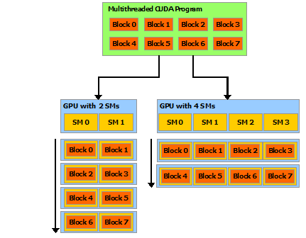

# 渲染探针

这页只做一件事：把「中英对照翻译」要用到的每种语法各摆一遍，看 Wiki.js 渲染成什么样。每一节后面标注了「期望结果」，验收时逐条核对。

## 1. 折叠块（中英对照首选形态）

「English original」这行可点开吗？

<details>
<summary>English original</summary>

This paragraph lives inside a collapsible block. If you can read it after expanding, then `<details>` survives sanitization, and the bilingual layout can fold the source text instead of duplicating every paragraph.

</details>

期望：出现可点击的「English original」折叠条，展开后能看到上面这段英文。

## 2. `markdown="1"` 的 div（源仓库大量使用）

<div class="probe-box" markdown="1">

| 列 A | 列 B |
|---|---|
| 一 | 二 |
| three | four |

</div>

期望：若上表被渲染成**表格**，说明 markdown 在 `markdown="1"` 的 div 内也会被处理；若显示成竖线与文字，则源仓库这类块需要在翻译阶段改写。

## 3. 课程头卡样式（源仓库共 129 处）

<div class="course-identity embedded-systems" markdown="1">
<div class="course-identity__icon">EMB</div>
<div markdown="1">
<p class="course-identity__eyebrow">Phase 2 · Embedded Systems</p>
<p class="course-identity__title">从抽象计算走到板子、总线、启动流程与产品。</p>
<p class="course-identity__meta">产物：bring-up 日志 + 嵌入式 demo · 量：启动、延迟、功耗、可靠性</p>
</div>
</div>

期望：三行文字按原样显示（样式可能丢失，内容不能丢）。

## 4. mermaid


期望：渲染成流程图；若显示成代码块，则源仓库里 6 处 mermaid 需要在翻译阶段转成图片或 ASCII。

## 5. 数学

行内：$E = mc^2$，算术强度 $I = \mathrm{FLOPs} / \mathrm{Bytes}$，KV cache 大小 $2 \cdot n_{layers} \cdot n_{kv} \cdot d_{head} \cdot L \cdot b$。

$$
\mathrm{TTFT} = t_{\mathrm{prefill}} + t_{\mathrm{queue}}
$$

期望：两处都渲染成数学式，而不是 `$` 包裹的原文。

## 6. 表格、任务列表、脚注

| 项目 | 值 |
|---|---|
| 上下文窗口 | $10^6$ tokens |
| 批大小 | 1（decode） |

- [x] 折叠块
- [ ] 图片
- [ ] 内链

脚注测试[^1]

[^1]: 这条若渲染成页面底部的脚注，说明脚注可用。

期望：表格成表格、任务列表带勾选框、脚注落在页尾。

## 7. 代码块与 ASCII 图

```bash
scons build/VEGA_X86/gem5.opt -j4
```

```text
┌──────────────────────────────┐
│  ASCII 架构图（保持原样）    │
│  SM ──▶ L2 ──▶ HBM           │
└──────────────────────────────┘
```

期望：代码高亮正常，ASCII 图不折行、不改字。

## 8. 图片的三种写法

相对路径：

根路径：

外链：

期望：三张图里至少「根路径」那张能显示（Wiki.js 的资产是按 `/<文件名或路径>` 提供的）。

## 9. 内链的三种写法

- 相对 `.md`：[相对链接](./Phase%202%20-%20Embedded%20Systems/渲染探针-链接目标.md)
- 站内根路径带扩展名：[根路径带扩展名](/学习资料/AI硬件工程师路线图/Phase%202%20-%20Embedded%20Systems/渲染探针-链接目标.md)
- 站内根路径去扩展名：[根路径去扩展名](/学习资料/AI硬件工程师路线图/Phase 2 - Embedded Systems/渲染探针-链接目标)

期望：三种里至少有一种能跳到「渲染探针-链接目标」页；据此决定翻译时链接怎么改写。

## 10. 中英对照成品样例

### 为什么 decode 常常是带宽瓶颈

decode 阶段每生成一个 token，都要把整套权重读一遍，而计算单元几乎跑不满：算术强度低到 roofline 的下沿，于是约束落在显存带宽而不是算力上。

<details>
<summary>English original</summary>

Decode is often memory-bandwidth bound: every generated token requires reading the entire weight set while the compute units stay mostly idle. Arithmetic intensity sits at the bottom of the roofline, so the binding ceiling is HBM bandwidth, not FLOPs.

</details>

期望：中文正文正常，英文可折展 —— 这就是将来 503 篇的页面形态。
