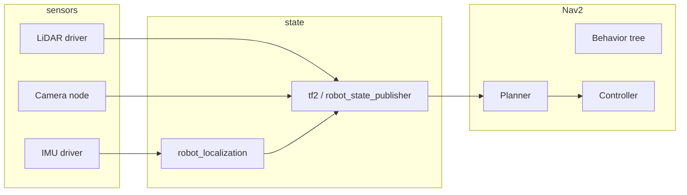

# 第 1 讲：高级机器人操作系统（ROS / ROS 2）

## 概述

本讲将 **ROS 2** 视为真实机器人上 **传感器**、**估计器**、**规划器** 和 **执行器** 之间的集成层。不同于只在 topic 上发布字符串的浅显教程，这里的目标是 **系统** 视角：你能解释为什么 TF 错误时 Nav2 会丢弃命令，为什么 bag 回放在不匹配 QoS 时会失去同步，以及操作与导航如何共存于同一个计算图中。

**到本讲结束时，你应该能够：**

* 为移动操作机器人（底盘 + 机械臂）绘制 ROS 2 **计算图**，并说出每条边上的主要消息类型。
* 为传感器流与低速率命令配置 **DDS QoS**，并说明理由。
* 通过 **TF2**、**代价地图** 和 **Nav2** 恢复行为追踪导航故障。
* 在“哪种工具适合哪种机器人”的层面上比较 **SLAM** 后端（SLAM Toolbox、Cartographer、RTAB-Map）。
* 描述 **`robot_localization`** 如何将里程计与 IMU 融合为面向 Nav2 的滤波状态。
* 概述 **MoveIt 2** 的规划场景 → 规划器 → 轨迹 → `ros2_control` 执行路径。

---

## 推荐课程（本方向）

与本讲配套的结构化课程（完整目录：[The Construct — Robotics & ROS](https://www.theconstruct.ai/robotigniteacademy_learnros/ros-courses-library/)）：

* [ROS 2 Basics in Python](https://app.theconstruct.ai/courses/ros2-basics-in-5-days-v2-python-268/) 或 [ROS 2 Basics in C++](https://app.theconstruct.ai/courses/ros2-basics-in-5-days-c-325/)——先选一种语言，然后再加另一种。
* [TF ROS 2](https://app.theconstruct.ai/courses/tf-ros2-217/)——坐标系与 `robot_state_publisher` 模式。
* [Intermediate ROS 2](https://app.theconstruct.ai/courses/intermediate-ros2-113/)——launch、参数、QoS、生命周期。
* [ROS 2 Navigation](https://app.theconstruct.ai/courses/ros2-navigation-galactic-109/) 与 [Advanced ROS 2 Navigation](https://app.theconstruct.ai/courses/advanced-ros2-navigation-116/)——Nav2 风格技术栈。
* [ROS 2 Manipulation Basics](https://app.theconstruct.ai/courses/ros2-manipulation-basics-81/) 或 [ROS 2 Manipulation & Perception](https://app.theconstruct.ai/courses/ros2-manipulation-perception-master-103/)——MoveIt 2 风格操作。
* [Robotics Specialization](https://www.coursera.org/specializations/robotics)（宾夕法尼亚大学）——空中机器人、规划、感知、移动性、capstone；数学与控制见长（作业中常用 MATLAB；不针对特定 ROS 版本）。

**官方参考资料（建议收藏）：**

* [ROS 2 documentation](https://docs.ros.org/)（选择你的发行版：Humble / Jazzy / Rolling）。
* [Navigation2](https://navigation.ros.org/)
* [MoveIt 2](https://moveit.picknik.ai/)
* [ros2_control](https://control.ros.org/)

---

## 1. ROS 2 架构：图、DDS 与执行器

### 1.1 心智模型

ROS 2 用 **DDS**（Data Distribution Service）取代 ROS 1 master。每个节点在网络上发现其他节点；**topic** 是利于多播的流；**service** 是 RPC；**action** 是带反馈的长时间运行目标（Nav2 和 MoveIt 2 大量使用）。



### 1.2 QoS：为什么你的 bag“几乎”能工作

**服务质量**（Quality of Service）配置控制可靠性、历史记录和截止时间。常见错误：用 **best-effort** 传感器录制 topic，再用 **reliable** 订阅者回放，或者反过来——然后消息静默丢弃或停滞。

| 流量类型 | 典型可靠性 | 备注 |
|--------------|---------------------|--------|
| 摄像头 / 激光雷达高速率 | 通常 **best effort** | 允许有损；减少积压 |
| 命令 / 目标 | **Reliable** | 必须到达 |
| TF（如果大量使用 `/tf`） | 匹配发布者 | 不匹配会导致变换缺失 |

**实用规则：** 调试时，对齐 **发布者和订阅者 QoS**；用 `ros2 topic info -v` 检查端点。

### 1.3 生命周期节点

许多 Nav2 和 ros2_control 组件是 **托管节点**（unconfigured → inactive → active）。Launch 文件按顺序启动技术栈；状态错误的节点会产生空行为树或零速度。当某事物“什么都不做”时，先检查 **生命周期状态**，再深入参数。

### 1.4 执行器与线程

单线程执行器更简单；当回调之间不能互相阻塞时（例如重感知），**多线程**执行器有帮助。代价：必须考虑 **锁** 和 **回调重入**。学习时，先从单线程开始；当性能剖析显示饥饿时，再增加线程。


<details>
<summary>English original</summary>

**Lecture 1: Advanced Robot Operating System (ROS / ROS 2)**

**Overview**

This lecture treats **ROS 2** as the integration layer between **sensors**, **estimators**, **planners**, and **actuators** on real robots. Unlike a shallow tutorial that only publishes strings on a topic, the goal here is a **systems** view: you can explain why Nav2 drops commands when TF is wrong, why a bag replay desynchronizes without matching QoS, and how manipulation and navigation coexist in one compute graph.

**By the end of this lecture you should be able to:**

* Draw the ROS 2 **compute graph** for a mobile manipulator (base + arm) and name the main message types on each edge.
* Configure **DDS QoS** for sensor streams vs low-rate commands and justify the choice.
* Trace a navigation failure through **TF2**, **costmaps**, and **Nav2** recovery behaviors.
* Compare **SLAM** back ends (SLAM Toolbox, Cartographer, RTAB-Map) at a “which tool for which robot” level.
* Describe how **`robot_localization`** fuses odometry and IMU into a filtered state for Nav2.
* Outline the **MoveIt 2** planning scene → planner → trajectory → `ros2_control` execution path.

---

**Recommended courses (this track)**

Structured courses that align with this lecture (full catalog: [The Construct — Robotics & ROS](https://www.theconstruct.ai/robotigniteacademy_learnros/ros-courses-library/)):

* [ROS 2 Basics in Python](https://app.theconstruct.ai/courses/ros2-basics-in-5-days-v2-python-268/) or [ROS 2 Basics in C++](https://app.theconstruct.ai/courses/ros2-basics-in-5-days-c-325/) — pick one language first, then add the other.
* [TF ROS 2](https://app.theconstruct.ai/courses/tf-ros2-217/) — frames and `robot_state_publisher` patterns.
* [Intermediate ROS 2](https://app.theconstruct.ai/courses/intermediate-ros2-113/) — launch, parameters, QoS, lifecycle.
* [ROS 2 Navigation](https://app.theconstruct.ai/courses/ros2-navigation-galactic-109/) and [Advanced ROS 2 Navigation](https://app.theconstruct.ai/courses/advanced-ros2-navigation-116/) — Nav2-style stacks.
* [ROS 2 Manipulation Basics](https://app.theconstruct.ai/courses/ros2-manipulation-basics-81/) or [ROS 2 Manipulation & Perception](https://app.theconstruct.ai/courses/ros2-manipulation-perception-master-103/) — MoveIt 2–style manipulation.
* [Robotics Specialization](https://www.coursera.org/specializations/robotics) (University of Pennsylvania) — aerial robotics, planning, perception, mobility, capstone; strong on math and control (often MATLAB in assignments; not ROS-version-specific).

**Official references (bookmark these):**

* [ROS 2 documentation](https://docs.ros.org/) (pick your distro: Humble / Jazzy / Rolling).
* [Navigation2](https://navigation.ros.org/)
* [MoveIt 2](https://moveit.picknik.ai/)
* [ros2_control](https://control.ros.org/)

---

**1. ROS 2 architecture: graph, DDS, and executors**

**1.1 Mental model**

ROS 2 replaces the ROS 1 master with **DDS** (Data Distribution Service). Every node discovers peers on the network; **topics** are multicast-friendly streams; **services** are RPC; **actions** are long-running goals with feedback (used heavily by Nav2 and MoveIt 2).


**1.2 QoS: why your bag “almost” works**

**Quality of Service** profiles control reliability, history, and deadline. Common mistake: recording a topic with **best-effort** sensors and replaying with **reliable** subscribers, or the reverse—then messages silently drop or stall.

| Traffic type | Typical reliability | Notes |
|--------------|---------------------|--------|
| Camera / LiDAR at high rate | Often **best effort** | Lossy OK; reduce backlog |
| Command / goal | **Reliable** | Must arrive |
| TF (if using `/tf` heavily) | Match publisher | Mismatches cause missing transforms |

**Practical rule:** For debugging, align **publisher and subscriber QoS**; use `ros2 topic info -v` to inspect endpoints.

**1.3 Lifecycle nodes**

Many Nav2 and ros2_control components are **managed nodes** (unconfigured → inactive → active). Launch files bring the stack up in order; a node in the wrong state yields empty behavior trees or zero velocity. When something “does nothing,” check **lifecycle state** before diving into parameters.

**1.4 Executors and threading**

Single-threaded executors are simpler; **multi-threaded** executors help when callbacks must not block each other (e.g. heavy perception). Cost: you must reason about **locks** and **callback re-entrancy**. For learning, start single-threaded; add threads when profiling shows starvation.

---

</details>

## 2. TF2：机器人集成的脊梁

**TF2** 维护一棵**随时间变化的坐标系树**：`map` → `odom` → `base_link` → `sensor_frame` → `tool0`。Nav2 期望一致的 **map–odom–base_link** 语义；机械臂操作期望 **base_link–arm–gripper**。

**常见故障**

* **变换缺失：** 通常是忘记 `static_transform_publisher`、时间戳错误，或传感器发布到了错误的坐标系。
* **向未来外推：** `tf2` 缓冲区长度有限；如果传感器时间有误（仿真时钟 vs 墙上时钟），查询就会失败。

**调试命令**

* `ros2 run tf2_tools view_frames`（生成该树的 PDF）。
* `ros2 topic echo /tf --once` 配合 `tf2_monitor` 使用。

**学习重点：** 能用一句话解释 `map`、`odom`、`base_link` 各自意味着什么，以及为什么 **odom 会漂移**，而 **map**（定位之后）不会。

---

## 3. 工具：bag、RViz2、rqt、launch

| 工具 | 用途 |
|------|-----|
| `ros2 bag record` / `play` | 无需硬件即可复现 bug；在相同数据上调 Nav2 |
| `rviz2` | 可视化 TF、代价地图、激光扫描、规划出的路径 |
| `rqt_graph` / `rqt` | 检查节点图并调动态参数 |
| `ros2 launch` | 组合参数化的功能栈；用 YAML 做覆盖 |

**Bag 工作流：** 录制重放该故障所需的**全部输入**（TF、scan、cmd_vel、odometry）。用**日期 + 场景**给 bag 命名；同时记录 ROS 发行版与各包版本。

---

## 4. Nav2：导航栈

Nav2 是一个**行为树驱动**的栈：它依据代价地图状态与规划器反馈，在**计算路径**、**跟随路径**、**恢复**（spin、backup、wait）和**全局定位**等行为之间做选择。

### 4.1 Costmaps

* **全局代价地图：** 面向长时域的规划，主要处理静态障碍物。
* **局部代价地图：** 短时域，更新快；为**控制器**提供输入（通常是 DWB、RPP 或类似插件）。

膨胀层把障碍物变成**梯度**，使机器人不会擦着墙角走。**footprint** 或**膨胀半径**设错，是“机器人永远进不了门洞”的首要原因。

### 4.2 规划器

**全局规划器**的例子：NavFn、Smac Planner（基于栅格，在结构化空间中往往更好）。**控制器**跟随局部代价地图并产生 `cmd_vel`。当机器人来回振荡或停住时，把问题拆开看：**全局路径**还是**局部跟踪**。

### 4.3 恢复

恢复行为之所以存在，是因为真实建筑里会出现**局部极小**。要学会读 **Nav2 日志**，弄清触发了哪个恢复行为、为什么触发。

---

## 5. SLAM 与定位

很少能不做选择就把 SLAM 当黑盒用：总得选定**地图表示**和**传感器组合**。

| 包 | 典型用途 | 备注 |
|---------|-------------|--------|
| **SLAM Toolbox** | 2D LiDAR，终身建图 | 在移动底盘上很流行 |
| **Cartographer** | 2D/3D，子图 | 调参可能比较费事 |
| **RTAB-Map** | RGB-D、立体视觉、LiDAR | 以相机为主时表现强 |

**只定位不建图：** 一旦地图存在，**AMCL**（或等价方案）就在地图中定位机器人。Nav2 期望由定位与里程计融合后给出稳定的 **map → odom** 变换。

---

## 6. 传感器融合：`robot_localization`

`robot_localization` 实现 **EKF/UKF**，把**轮式里程计**、**IMU**、**GPS**（室外）以及可选的视觉里程计融合成平滑的 `odom` → `base_link` 估计。你可以配置**哪些传感器更新哪些状态分量**（例如 IMU 更新姿态，轮子更新 x、y）。

**为什么重要：** 原始轮式编码器会打滑，IMU 会漂移；融合为 Nav2 提供用于控制的**稳定速度与航向**。

---

## 7. `ros2_control`：从消息到力矩

**ros2_control** 把**硬件接口**（读关节 / 写力矩）与**控制器**（PID、轨迹跟随）分开。MoveIt 2 通常把**轨迹**发给轨迹控制器；移动底盘用 **diff_drive** 或类似插件。

概念上的流水线：

```text
MoveIt 2 → trajectory_msgs/JointTrajectory → trajectory_controller → hardware_interface → driver
```

一开始不必自己写硬件接口，但你**确实**需要知道当前**哪个控制器是激活的**，以及哪些**关节名**与 URDF 对得上。

---

## 8. MoveIt 2：机械臂操作

**MoveIt 2** 串联起**感知（可选）** → **规划场景**（碰撞几何）→ **运动规划器**（OMPL、Pilz、CHOMP 等）→ **轨迹执行**。

* **规划场景：** mesh 与几何图元障碍物；通常由深度图或桌面平面分割更新。
* **规划组：** 机械臂与夹爪分开；**末端执行器**位姿在笛卡尔空间或关节空间中规划。
* **流水线集成：** 抓取放置就是**状态机**的粘合：定位物体 → 规划接近 → 抓取 → 退回 → 放置。

---


<details>
<summary>English original</summary>

**2. TF2: the spine of robotics integration**

**TF2** maintains a **time-varying tree** of coordinate frames: `map` → `odom` → `base_link` → `sensor_frame` → `tool0`. Nav2 expects consistent **map–odom–base_link** semantics; manipulation expects **base_link–arm–gripper**.

**Common failures**

* **Missing transform:** Usually forgotten `static_transform_publisher`, wrong timestamp, or sensor publishing in the wrong frame.
* **Extrapolation into the future:** `tf2` buffers are finite; if your sensor time is wrong (sim clock vs wall clock), lookups fail.

**Debugging commands**

* `ros2 run tf2_tools view_frames` (generate PDF of the tree).
* `ros2 topic echo /tf --once` combined with `tf2_monitor`.

**Study focus:** Be able to explain, in one sentence, what each of `map`, `odom`, and `base_link` means and why **odom drifts** but **map** (after localization) does not.

---

**3. Tools: bags, RViz2, rqt, launch**

| Tool | Use |
|------|-----|
| `ros2 bag record` / `play` | Reproduce bugs without hardware; tune Nav2 on identical data |
| `rviz2` | Visualize TF, costmaps, laser scans, planned paths |
| `rqt_graph` / `rqt` | Inspect graph and tune dynamic parameters |
| `ros2 launch` | Compose parameterized stacks; use YAML for overrides |

**Bag workflow:** Record **all inputs** needed to replay the failure (TF, scans, cmd_vel, odometry). Name bags with **date + scenario**; document ROS distro and package versions alongside.

---

**4. Nav2: navigation stack**

Nav2 is a **behavior-tree-driven** stack: it selects among **compute path**, **follow path**, **recovery** (spin, backup, wait), and **global localization** behaviors depending on costmap state and planner feedback.

**4.1 Costmaps**

* **Global costmap:** Long-horizon planning over mostly static obstacles.
* **Local costmap:** Short horizon, updated fast; feeds the **controller** (often DWB, RPP, or similar plugins).

Inflation layers turn obstacles into **gradients** so the robot does not graze corners. Wrong **footprint** or **inflation radius** is a top cause of “robot never enters doorways.”

**4.2 Planners**

**Global planner** examples: NavFn, Smac Planner (grid-based, often better in structured spaces). **Controller** follows the local costmap and produces `cmd_vel`. When the robot oscillates or stops, split the issue: **global path** vs **local tracking**.

**4.3 Recovery**

Recoveries exist because **local minima** happen in real buildings. Learn to read **Nav2 logs** to see which recovery fired and why.

---

**5. SLAM and localization**

You rarely “use SLAM” as a black box without choosing a **map representation** and **sensor suite**.

| Package | Typical use | Notes |
|---------|-------------|--------|
| **SLAM Toolbox** | 2D LiDAR, lifelong mapping | Popular on mobile bases |
| **Cartographer** | 2D/3D, submaps | Tuning can be involved |
| **RTAB-Map** | RGB-D, stereo, LiDAR | Strong when cameras are primary |

**Localization without mapping:** Once a map exists, **AMCL** (or equivalent) localizes the robot in the map. Nav2 expects a consistent **map → odom** transform from localization fused with odometry.

---

**6. Sensor fusion: `robot_localization`**

`robot_localization` implements **EKF/UKF** to fuse **wheel odometry**, **IMU**, **GPS** (outdoor), and optional visual odometry into a smooth `odom` → `base_link` estimate. You configure **which sensors update which state components** (e.g. IMU for orientation, wheels for x,y).

**Why it matters:** Raw wheel encoders slip; IMU drifts; fusion gives Nav2 a **stable velocity and heading** for control.

---

**7. `ros2_control`: from messages to torque**

**ros2_control** separates **hardware interfaces** (read joints / write efforts) from **controllers** (PID, trajectory following). MoveIt 2 typically sends **trajectories** to a trajectory controller; mobile bases use **diff_drive** or similar.

Conceptual pipeline:

```text
MoveIt 2 → trajectory_msgs/JointTrajectory → trajectory_controller → hardware_interface → driver
```

You do not need to write a custom hardware interface on day one, but you **do** need to know which **controller is active** and which **joint names** match the URDF.

---

**8. MoveIt 2: manipulation**

**MoveIt 2** connects **perception (optional)** → **planning scene** (collision geometry) → **motion planner** (OMPL, Pilz, CHOMP, …) → **trajectory execution**.

* **Planning scene:** Mesh and primitive obstacles; often updated from depth or table plane segmentation.
* **Planning groups:** Arm vs gripper; **end-effector** poses are planned in Cartesian or joint space.
* **Pipeline integration:** Pick-and-place is **state machine** glue: locate object → plan approach → grasp → retreat → place.

---

</details>

## 9. 集成项目（来自本路线图）

* **自主移动机器人：** SLAM → map → AMCL → Nav2 → RViz2 中的目标位姿；记录 bag，在修改 costmap 参数后回放。
* **机械臂：** URDF + MoveIt 2 配置 → 在 RViz2 中规划 → 先在仿真（`ros2_control` + Gazebo）中执行，若硬件可用再在硬件上执行。

---

## 10. 自检

1. 解释 **`map`→`odom`** 与 **`odom`→`base_link`** 变换之间的区别。
2. 说出 Nav2 在目标有效的情况下仍发布 **零速度** 的两个原因。
3. 若时间戳不一致，为什么**提高激光雷达（LiDAR）速率**可能导致 TF 查找失败？
4. 与仅使用原始轮式里程计相比，**`robot_localization`** 改善了哪一点？

---

## 资源

* **结构化课程：** 见上文 **推荐课程**；[main Robotics Application guide](/学习资料/AI硬件工程师路线图/阶段5-高级专题与专精/04-方向D-机器人/Guide) 列出了所有 track（§1–§3）。
* Quigley、Gerkey 和 Smart 所著 **"Programming Robots with ROS"** —— ROS 概念（承自 ROS 1；其思路仍有价值；可配合 ROS 2 文档使用）。
* **ROS 2 文档：** [docs.ros.org](https://docs.ros.org/)
* **MoveIt 2 文档：** [moveit.picknik.ai](https://moveit.picknik.ai/)

---

## 本路线图的后续内容

* **工业部署、仿真、嵌入式：** [Lecture 2 — Industrial and Embedded Robotics](/学习资料/AI硬件工程师路线图/阶段5-高级专题与专精/04-方向D-机器人/03-工业与嵌入式机器人/Lecture-01)
* **感知、跟踪、深度学习：** [Lecture 3 — Advanced Perception and AI for Robotics](/学习资料/AI硬件工程师路线图/阶段5-高级专题与专精/04-方向D-机器人/01-机器人高级感知与AI/Lecture-01)


<details>
<summary>English original</summary>

**9. Integrated projects (from this roadmap)**

* **Autonomous mobile robot:** SLAM → map → AMCL → Nav2 → goal poses in RViz2; log a bag and replay after changing costmap parameters.
* **Robotic arm:** URDF + MoveIt 2 config → plan in RViz2 → execute on sim (`ros2_control` + Gazebo) then on hardware if available.

---

**10. Self-check**

1. Explain the difference between **`map`→`odom`** and **`odom`→`base_link`** transforms.
2. Name two reasons Nav2 would publish **zero velocity** despite a valid goal.
3. Why might **increasing LiDAR rate** make TF lookups fail if timestamps are inconsistent?
4. What does **`robot_localization`** improve compared to raw wheel odometry alone?

---

**Resources**

* **Structured courses:** See **Recommended courses** above; the [main Robotics Application guide](/学习资料/AI硬件工程师路线图/阶段5-高级专题与专精/04-方向D-机器人/Guide) lists all tracks (§1–§3).
* **"Programming Robots with ROS"** by Quigley, Gerkey, and Smart — ROS concepts (ROS 1 heritage; still useful for ideas; pair with ROS 2 docs).
* **ROS 2 documentation:** [docs.ros.org](https://docs.ros.org/)
* **MoveIt 2 documentation:** [moveit.picknik.ai](https://moveit.picknik.ai/)

---

**Next in this roadmap**

* **Industrial deployment, simulation, embedded:** [Lecture 2 — Industrial and Embedded Robotics](/学习资料/AI硬件工程师路线图/阶段5-高级专题与专精/04-方向D-机器人/03-工业与嵌入式机器人/Lecture-01)
* **Perception, tracking, deep learning:** [Lecture 3 — Advanced Perception and AI for Robotics](/学习资料/AI硬件工程师路线图/阶段5-高级专题与专精/04-方向D-机器人/01-机器人高级感知与AI/Lecture-01)

</details>

---

> 原文：[`Phase 5 - Advanced Topics and Specialization/Track D - Robotics/Advanced Robot Operating System/Lecture-01.md`](https://github.com/ai-hpc/ai-hardware-engineer-roadmap/blob/main/Phase%205%20-%20Advanced%20Topics%20and%20Specialization/Track%20D%20-%20Robotics/Advanced%20Robot%20Operating%20System/Lecture-01.md)（上游仓库 ai-hpc/ai-hardware-engineer-roadmap，MIT License）。本页为中文翻译，术语保留英文原词；与原文不一致时以原文为准。
