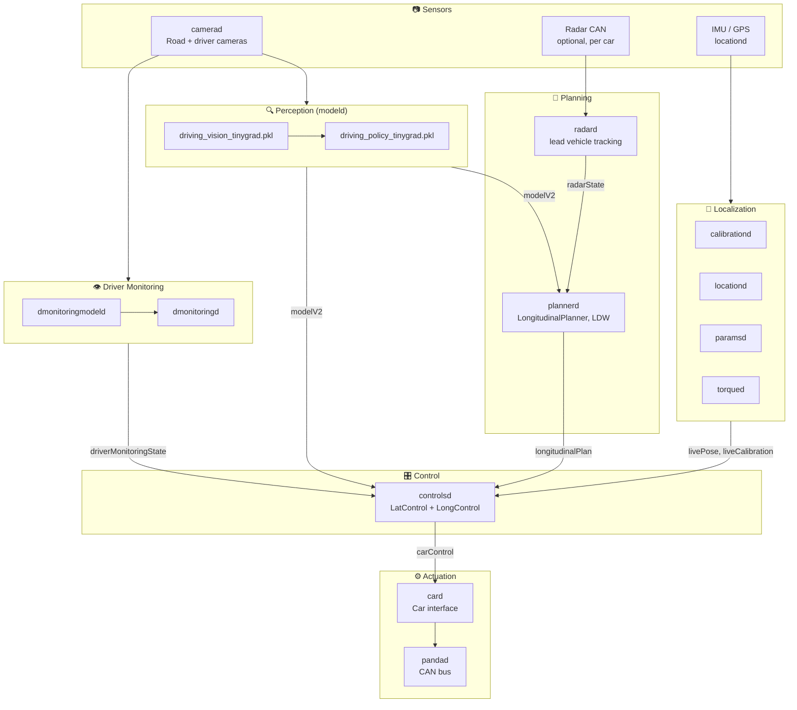
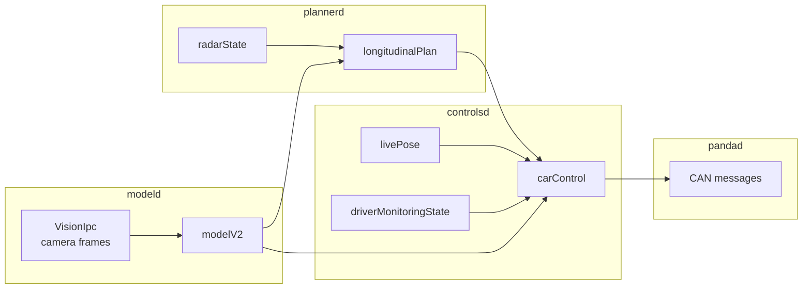
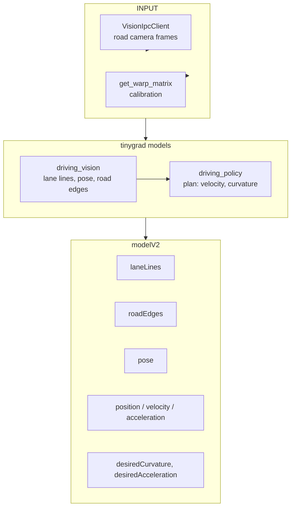
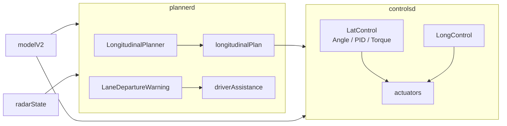
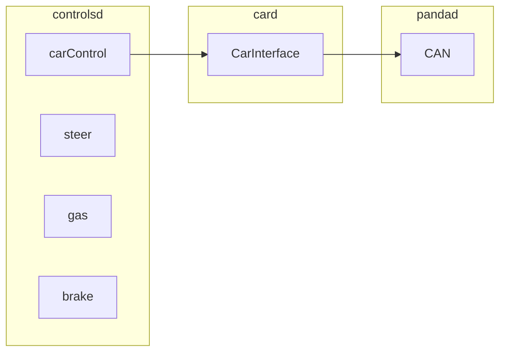

# Openpilot 流水线 — 流程图

**openpilot**（comma.ai）中的端到端数据流，从摄像头输入到 CAN 执行。基于 [commaai/openpilot repository](https://github.com/commaai/openpilot) 中实际的进程布局。

---

## 高层流水线

```
┌─────────────┐    ┌─────────────┐    ┌─────────────┐    ┌─────────────┐    ┌─────────────┐
│  camerad    │───▶│   modeld   │───▶│  plannerd   │───▶│ controlsd  │───▶│   pandad    │
│  (camera)   │    │  (tinygrad) │    │  radard     │    │  (lat+long) │    │   (CAN)     │
└─────────────┘    └─────────────┘    └─────────────┘    └─────────────┘    └─────────────┘
                          │                    │
                          │                    └── radarState (lead vehicle)
                          └── modelV2 (lanes, plan, pose)
```

---

## 进程级流程（Openpilot）



---

## 消息流（cereal）



---

## modeld：感知细节



**modeld 输出**（来自 `fill_model_msg`、`parse_model_outputs`）：
- 车道线、道路边缘、车道线概率
- 位姿（道路变换、设备位姿）
- 规划（随时间的位置、速度、加速度）
- 动作（期望曲率、期望加速度、shouldStop）
- FCW（前向碰撞）概率

---

## plannerd → controlsd



**plannerd** 订阅：`modelV2`、`carState`、`radarState`、`controlsState`、`liveParameters`  
**plannerd** 发布：`longitudinalPlan`、`driverAssistance`

**controlsd** 订阅：`modelV2`、`longitudinalPlan`、`livePose`、`liveCalibration`、`carState`、`driverMonitoringState`  
**controlsd** 发布：`carControl`（执行器）

---

## controlsd → CAN



---


<details>
<summary>English original</summary>

**Openpilot Pipeline — Flow Diagram**

End-to-end data flow in **openpilot** (comma.ai), from camera input to CAN actuation. Based on the actual process layout in the [commaai/openpilot repository](https://github.com/commaai/openpilot).

---

**High-Level Pipeline**

```
┌─────────────┐    ┌─────────────┐    ┌─────────────┐    ┌─────────────┐    ┌─────────────┐
│  camerad    │───▶│   modeld   │───▶│  plannerd   │───▶│ controlsd  │───▶│   pandad    │
│  (camera)   │    │  (tinygrad) │    │  radard     │    │  (lat+long) │    │   (CAN)     │
└─────────────┘    └─────────────┘    └─────────────┘    └─────────────┘    └─────────────┘
                          │                    │
                          │                    └── radarState (lead vehicle)
                          └── modelV2 (lanes, plan, pose)
```

---

**Process-Level Flow (Openpilot)**


---

**Message Flow (cereal)**


---

**modeld: Perception Detail**


**modeld outputs** (from `fill_model_msg`, `parse_model_outputs`):
- Lane lines, road edges, lane line probabilities
- Pose (road transform, device pose)
- Plan (position, velocity, acceleration over time)
- Action (desired curvature, desired acceleration, shouldStop)
- FCW (forward collision) probabilities

---

**plannerd → controlsd**


**plannerd** subscribes: `modelV2`, `carState`, `radarState`, `controlsState`, `liveParameters`  
**plannerd** publishes: `longitudinalPlan`, `driverAssistance`

**controlsd** subscribes: `modelV2`, `longitudinalPlan`, `livePose`, `liveCalibration`, `carState`, `driverMonitoringState`  
**controlsd** publishes: `carControl` (actuators)

---

**controlsd → CAN**


---

</details>

## Openpilot 专项说明

| Aspect | Openpilot |
|--------|-----------|
| **Sensors** | 以摄像头为主；radar 可选（取决于车型） |
| **Perception** | modeld 中的端到端 NN（vision + policy）；无显式 2D/3D 检测 |
| **Planning** | plan 由 model 生成；plannerd 补充纵向控制（ACC、前车跟随）与 LDW |
| **Control** | LatControl（angle/PID/torque）、LongControl；车型相关部分经 opendbc 实现 |
| **Inference** | tinygrad（driving_vision、driving_policy、dmonitoring） |
| **Messaging** | cereal（capnp）经 IPC |

---

## 进程 → 源码映射

| 进程 | 路径 |
|---------|------|
| camerad | `system/camerad/` — [camerad 指南](/学习资料/AI硬件工程师路线图/阶段5-高级专题与专精/05-方向E-自动驾驶/02-openpilot参考栈/02-camerad/Guide) |
| modeld | `selfdrive/modeld/modeld.py` |
| dmonitoringmodeld | `selfdrive/modeld/dmonitoringmodeld.py` |
| dmonitoringd | `selfdrive/monitoring/dmonitoringd.py` |
| locationd | `selfdrive/locationd/locationd.py` |
| calibrationd | `selfdrive/locationd/calibrationd.py` |
| radard | `selfdrive/controls/radard.py` |
| plannerd | `selfdrive/controls/plannerd.py` |
| controlsd | `selfdrive/controls/controlsd.py` |
| card | `selfdrive/car/card.py` |
| pandad | `selfdrive/pandad/` |


<details>
<summary>English original</summary>

**Openpilot-Specific Notes**

| Aspect | Openpilot |
|--------|-----------|
| **Sensors** | Camera(s) primary; radar optional (car-dependent) |
| **Perception** | End-to-end NN (vision + policy) in modeld; no explicit 2D/3D detection |
| **Planning** | Plan from model; plannerd adds longitudinal (ACC, lead follow) and LDW |
| **Control** | LatControl (angle/PID/torque), LongControl; vehicle-specific via opendbc |
| **Inference** | tinygrad (driving_vision, driving_policy, dmonitoring) |
| **Messaging** | cereal (capnp) over IPC |

---

**Process → Source Map**

| Process | Path |
|---------|------|
| camerad | `system/camerad/` — [camerad Guide](/学习资料/AI硬件工程师路线图/阶段5-高级专题与专精/05-方向E-自动驾驶/02-openpilot参考栈/02-camerad/Guide) |
| modeld | `selfdrive/modeld/modeld.py` |
| dmonitoringmodeld | `selfdrive/modeld/dmonitoringmodeld.py` |
| dmonitoringd | `selfdrive/monitoring/dmonitoringd.py` |
| locationd | `selfdrive/locationd/locationd.py` |
| calibrationd | `selfdrive/locationd/calibrationd.py` |
| radard | `selfdrive/controls/radard.py` |
| plannerd | `selfdrive/controls/plannerd.py` |
| controlsd | `selfdrive/controls/controlsd.py` |
| card | `selfdrive/car/card.py` |
| pandad | `selfdrive/pandad/` |

</details>

---

> 原文：[`Phase 5 - Advanced Topics and Specialization/Track E - Autonomous Vehicles/2. openpilot Reference Stack/flow-diagram.md`](https://github.com/ai-hpc/ai-hardware-engineer-roadmap/blob/main/Phase%205%20-%20Advanced%20Topics%20and%20Specialization/Track%20E%20-%20Autonomous%20Vehicles/2.%20openpilot%20Reference%20Stack/flow-diagram.md)（上游仓库 ai-hpc/ai-hardware-engineer-roadmap，MIT License）。本页为中文翻译，术语保留英文原词；与原文不一致时以原文为准。
